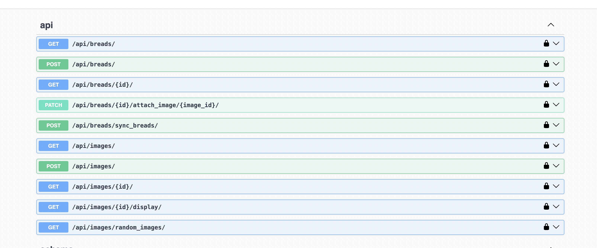

# ️⚡️ Collecter service ⚡️

## Project Description

This service expose APIs to manipulate breads and images. We can see all endpoints on documents at /docs

There are a special endpoint that allow we sync bread from third party service. The sync task is running in the backgroud through celery
This service based on django rest framework. We utilize class base view to reduce the workload

## Table of Content
* [Project Description](#project-description)
* [Getting Started](#getting-started)
  + [Running Locally](#running-locally)
    + [Prerequisites](#local-prerequisites)
    + [Setup](#local-setup)
  + [Running On Docker](#running-on-docker)
    + [Prerequisites](#docker-prerequisites)
    + [Setup](#docker-setup)
  + [Continuous Integration](#continuous-integration)
  + [Continuous Deployment](#continuous-deployment)
  + [Improvement](#improvement)


## <a id="getting-started"> Getting Started </a>


## <a id="running-locally"> Running Locally</a>

### <a id="local-prerequisites"> Prerequisites</a>
  - Python >= 3.12
  - Pip >= 18.0
  - Poetry
  - Redis
  - Postgre
  - RabitMQ

### <a id="local-setup"> Setup</a>
1. Install all dependencies at the Prerequisites step
2. Install poetry and install depedencies's project through poetry
3. Run the command below
``` bash
    python manage.py runserver
```

## <a id="running-on-docker"> Running On Docker</a>
### <a id="docker-prerequisites"> Prerequisites</a>
  - Docker - [Install Docker](https://www.digitalocean.com/community/tutorials/how-to-install-and-use-docker-on-ubuntu-20-04)
  - Docker-compose - [Install Docker-compose](https://www.digitalocean.com/community/tutorials/how-to-install-and-use-docker-compose-on-ubuntu-20-04)

### <a id="docker-setup"> Setup</a>
1. Create .env file inside the envs folder as .env.sample in the root folder and update the values
2. Build:  `docker-compose build`
3. Run: `docker-compose up`

## Usage
1. Using curl or other tools, you can send requests to the endpoints through methods defined here:
```http://127.0.0.1:8000/```

2. Documents for testing can be found at here:
```http://127.0.0.1:8000/docs```



## <a id="continuous-integration"> Continuous Integration</a>
tbd

## <a id="continuous-deployment"> Continuous Deployment</a>
tbd


## <a id="improvement"> Improvement</a>

1. Improvement
- Sync endpoint allow we see synchronization progress if we is in the sync processing.
